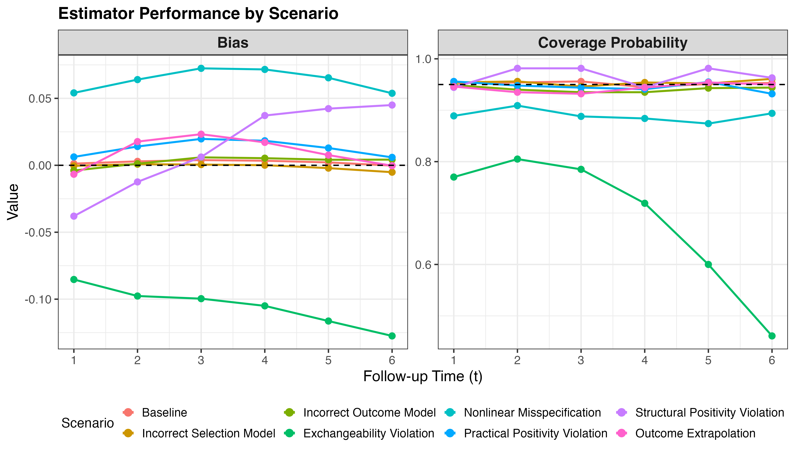
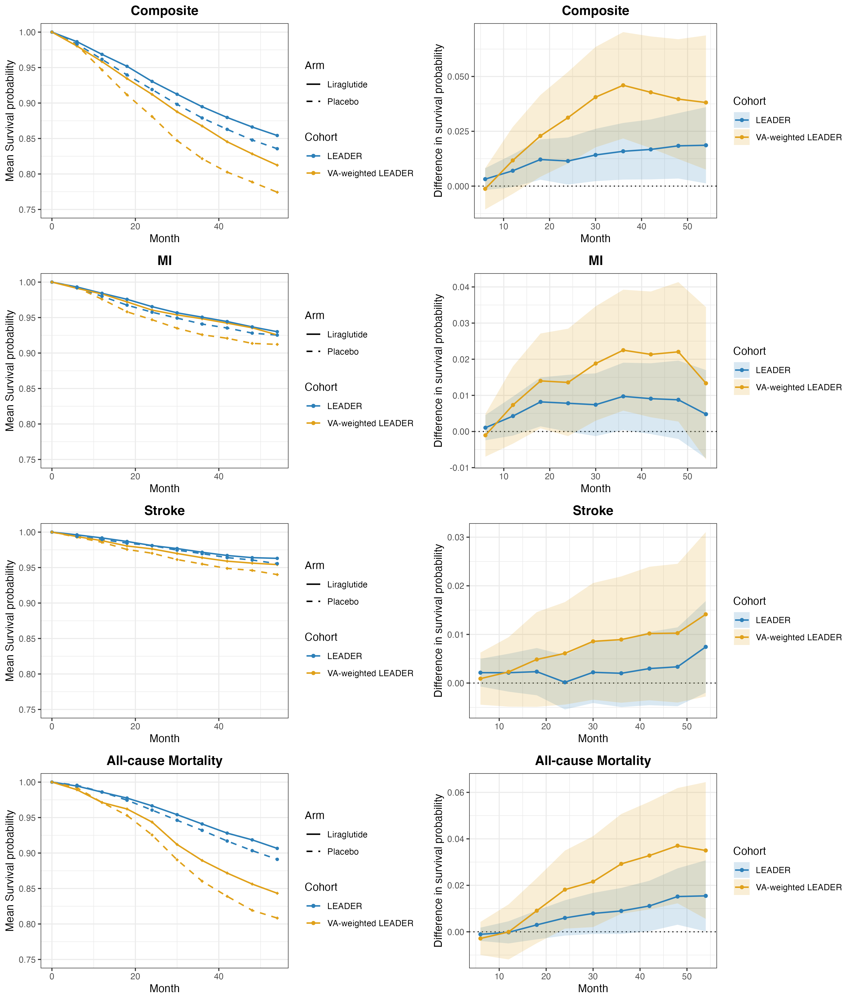

# Real-world Cardiovascular Effects of Liraglutide

Doubly-robust **transportability** of the cardiovascular effect of liraglutide from the
**LEADER** trial to real-world **Veterans Affairs (VA)** cohorts.

R code for *"Real-world cardiovascular effects of liraglutide: transportability analysis
of the LEADER trial"* (under review;
[preprint on medRxiv](https://www.medrxiv.org/content/10.1101/2025.05.12.25327466v3)).
Two parts: an **applied analysis** (LEADER → VA cohorts A–E) and a **simulation study**.
Individual-level data are **not** included.

## Method

Transport the liraglutide-vs-placebo effect from the LEADER RCT to VA cohorts that
progressively relax trial eligibility. The estimand is the target-population survival
difference `psi(t) = E[S(t; A=1) − S(t; A=0) | S = 0]` at landmark times, for four
endpoints (composite MACE, MI, stroke, all-cause death). The estimator is augmented IPW
(doubly robust): approximate balancing weights (`optweight`) paired with a
pseudo-observation survival model (`eventglm` + `SuperLearner`, 5-fold cross-fitting), with
closed-form influence-function variances and Wald intervals.

## Results

**Figure 1 — Simulation.** Estimator bias and 95% CI coverage across 8 scenarios spanning
model misspecification and positivity violations. The estimator is approximately unbiased
with nominal coverage except under exchangeability violation (unmeasured `U` in both
nuisances) and severe positivity stress.



**Figure 2 — Applied (LEADER → VA cohort A).** Survival probabilities (left) and risk
differences (right) for LEADER (blue) and VA-weighted LEADER (yellow), by endpoint.
Transporting to the VA target generally widens the estimated benefit relative to the trial.



## Repository

```
leader-transport/
├── transport_helpers.R          # AIPW estimator: temp(), temp_m(), make_samp()
├── Trans_LEADER_primary_v2.R    # primary analysis, cohorts A–E
├── Trans_LEADER_sensitivity.R   # sensitivity analyses (cohort A)
├── make_figures.R               # applied figures
├── Simulation/                  # 01_dgp.R, 02_estimators.R, 03_run_simulation.R
└── Figures/                     # manuscript figures
```

VA cohorts A–E nest: A (A1C ≥ 7%, age ≥ 50, cardiac disease or CKD 3–4), then drop the A1C
(B), age (C), and CVD/CKD (D) requirements in turn; E is the full VA cohort.

## Citation

> Josey KP, Liu W, Warsavage T, Medici M, Kvist K, Derington CG, Reusch JEB, Ghosh D,
> Raghavan S. *Real-world cardiovascular effects of liraglutide: transportability analysis
> of the LEADER trial.* medRxiv 2025.05.12.25327466 (v3, posted 2026-01-30).
> doi:[10.1101/2025.05.12.25327466](https://doi.org/10.1101/2025.05.12.25327466)

```bibtex
@article{josey_leader_transport,
  author  = {Josey, K. P. and Liu, W. and Warsavage, T. and Medici, M. and Kvist, K.
             and Derington, C. G. and Reusch, J. E. B. and Ghosh, D. and Raghavan, S.},
  title   = {Real-world cardiovascular effects of liraglutide: transportability analysis of the {LEADER} trial},
  journal = {medRxiv},
  year    = {2025},
  doi     = {10.1101/2025.05.12.25327466},
  note    = {Preprint, version 3, posted 2026-01-30}
}
```

Questions: contact Kevin Josey ([@kjosey](https://github.com/kjosey)).
